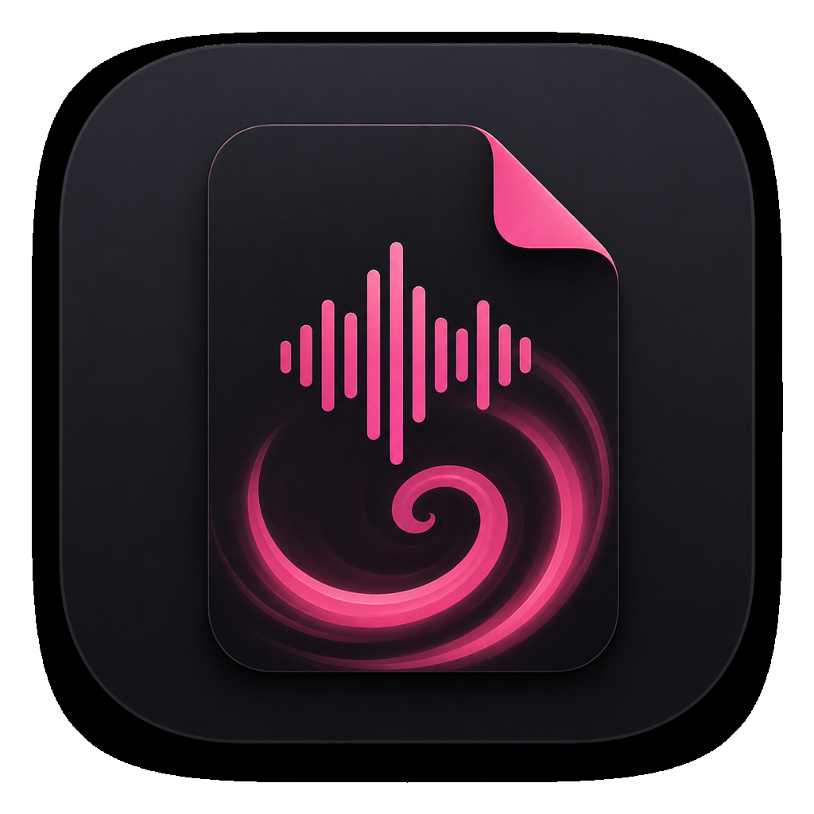

<p align="center">
  
</p>

<!-- shield badges go here -->

**Release 1 Beta**

## Mission statement

I don’t want to pay for audio transcription and I like privacy. My laptop was not powerful enough to run the models locally. So I created this app to get a mixture of both.

## Current Features

- Upload an audio file, transcribe it on an external cloud provider, identify speakers, and use claude to summarize
- Browse your recordings
- Playback files

## HOW TO INSTALL

First, install [bun](https://bun.sh) (package manager):

```bash
curl -fsSL https://bun.sh/install | bash
```

Then run maiscribe:

```bash
cd src/app
bun install
bun run dev
```

## How it works

1. I set this up with Modal, a serves cloud platform that has a free tier (I will be configuring a version to let this run on your local machine). Modal does not use your data as of now, and is technically secure. But it does leave your machine.
2. You accept the hugging face models that do the things. Maiscribe handles the app install for you.
3. You can set up a claude api key if you want summarization (this part is not secure).

## SCREENSHOTS HERE

## Setup instructions

The wizard will walk you through this though.

### MODAL SET UP

1. Create an account if you don’t have one
2. Set up a workspace
3. Add a card (generous free tier you shouldn’t get charged unless you run a lot of files)
4. Save your key for the wizard

### HUGGING FACE SET UP

1. Set up an account
2. Get your key
3. Accept these models:
   - [pyannote/speaker-diarization-3.1](https://huggingface.co/pyannote/speaker-diarization-3.1)
   - [pyannote/segmentation-3.0](https://huggingface.co/pyannote/segmentation-3.0)
   - [pyannote/embedding](https://huggingface.co/pyannote/embedding)

### CLAUDE API KEY

- Must use developer platform
- This is also charge by use, cheap
- Optional. You can skip summarization

## Future Features

- Run the transcription on your local machine
- Smart Speaker Detection
- Audio File Tagging for Organization (Tag by meeting)
- Ask an agent about your transcriptions (“Tell me about the daily status update meetings over the last week”)
